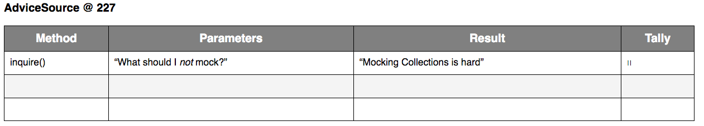

## MetaMocking Instructions

Form groups of two or three. Together, you will manually perform unit tests for
`ATALearningProcess` in a way similar to the unit testing framework.
In this process, we’ll be testing the `ask()` method, which allows a participant
to ask a question and chooses a clear answer from multiple `AdviceSource`s,
such as instructors and mentors.

```java
/**
 * Find a reasonably clear Response for the question from 
 * among the available AdviceSources.
 * 
 * @param question The question to ask.
 * @returns a Response from the first AdviceSource with at least 85%
 *          clarity, or the best response from all sources.
 */
public Response ask(String question) {
   // Implementation omitted
}
```

Choose one person to perform the role of the Unit Being Tested, `ATALearningProcess`.
The other partner(s) will play the role of the Mock Objects.
Instructors will play the role of the `Instructor` objects (and any other non-mocked objects).
We will switch roles after executing each test (although instructors will always be the `Instructor`s). 

The partner(s) playing the Mock Ojbect Role will keep track of which methods of a mock object are being
called using a worksheet like the one below. This example shows a mocked `AdviceSource`
at memory reference `227`, which has been called twice with the parameter "What should I *not* mock?": 



Pick up your role's worksheet now!
