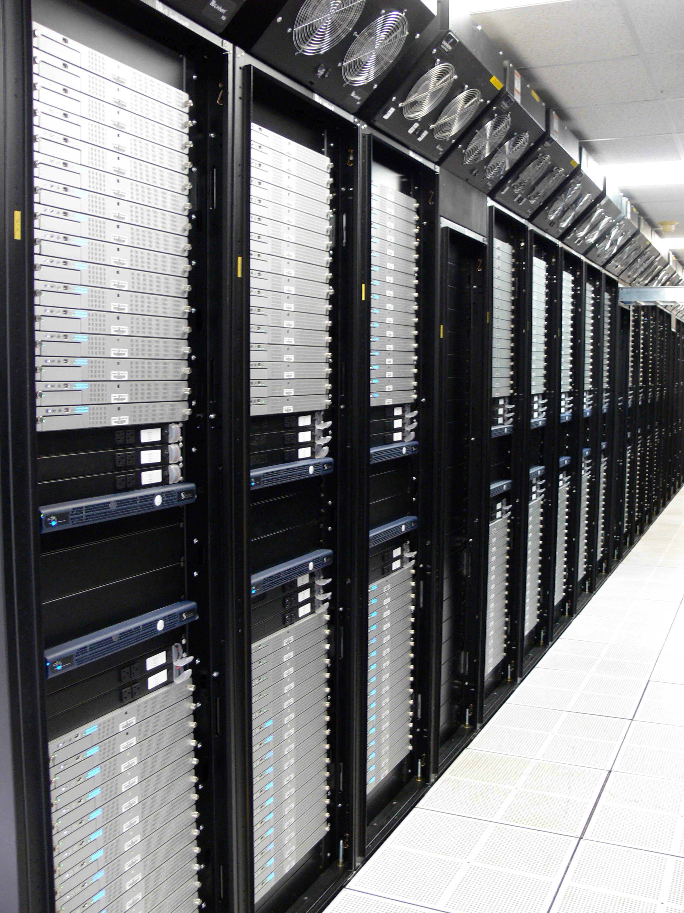

# RackMonitor Coding GILA

## GILA Roles

Read more about the roles: [GILA Roles](https://w.amazon.com/bin/view/Amazon_Technical_Academy/Internal/HowTos/GILARoles)

## Activity

**This activity helps you develop an approach to writing tests with mocking.**
It also allows you to practice writing test code using mocks.

Before you start, complete the form below to assign a role to each member.
If you have 3 people, combine the **Presenter** and **Reflector**.

|Team Roles	|Team Member	|
|---	|---	|
|**Recorder**: records all answers and questions, provides copies to team and facilitator.	|	|
|**Presenter**: talks to facilitator and other teams.	|	|
|**Manager**: keeps track of time and makes sure everyone contributes appropriately.	|	|
|**Reflector**: considers how the team could work and learn more effectively.	|	|

You should complete the coding portion of this activity on the branch:
`mocking-classroom`. All relevant code can be found in the
`com.amazon.ata.mocking.rackmonitor.instructions` Java package of your
`ATAClassroomSnippets_U2` Brazil package. Individual code browser links will be
submitted via a Canvas quiz after you have completed the activity.

## Introduction

Amazon needs lots of computers to run all those AWS services.
Each computer is called a "server", and we stack 20 or 30 of them in a "rack".
Then we put hundreds of racks in a data center, wire them together, and offer
them to our customers.

*Racks of servers in a (non-Amazon) data center*

Each rack has sensors that report the power usage, temperature, and other
metrics that indicate the health of its servers. Data centers periodically
call a `RackMonitor` program, which checks if any server needs attention.

Here's a class diagram showing how `RackMonitor` works:

*RackMonitor Class Diagram: `RackMonitor` gets `Server` health from `Rack`s,
uses a `WarrantyClient` to look up the `Server`'s `Warranty`, and requests
inspection or replacement through `WingnutClient`. It tracks its own requests
through the `HealthIncident` class and `RequestAction` enumeration.*

The data center calls `monitorRacks()` periodically. That calls
`getHealth()` on every `Rack` it knows about. The `Map` that comes back is a
"health factor" for each `Server` , from 0.0 if the server has turned into a
very expensive doorstop, up to 1.0 if the server is shiny, new, and working
perfectly. If any server has a health factor lower than 0.9, we want a
technician to inspect it for imminent flaws. Any server with a health factor of
less than 0.8 should be replaced... before it fails.

The `WingnutClient` provides the methods we need to get a technician to handle
our server problems. They don't know anything about `Server`s, though, so we
have to tell them what `Rack` the problem server is in, and which "unit" slot
it's installed in. `Rack` has a `getUnitForServer()` method that tells us which
unit slot any given `Server` is in.

If a `Server` needs to be replaced, we may be able to get a replacement under
warranty! The `WarrantyClient` lets us look up any `Server`'s `Warranty` with
its `getWarrantyForServer()` method.

Unfortunately, all these services run on servers, which might have problems of
their own. If something goes wrong with Wingnut, our `WingnutClient` calls
could return a `WingnutServiceException`. If we just passed in bad parameters,
we'll get a `WingnutClientException`. If a `Server` doesn't have a `Warranty` --
which it *always* should -- we'll get a `WarrantyNotFoundException`. Even
`Rack` checks its inputs, and throws `NoSuchServerException` if we try to get a
`Server` from a `Rack` where it isn't installed. `RackMonitor` converts these
to `RackMonitorException` if it's something it did wrong, and
`RackMonitorDependencyException` if something went wrong with a dependency.
Note that all these exceptions are *checked* exceptions, so the compiler will
complain if the code doesn't `catch` them or declare that the method `throws`
them.

